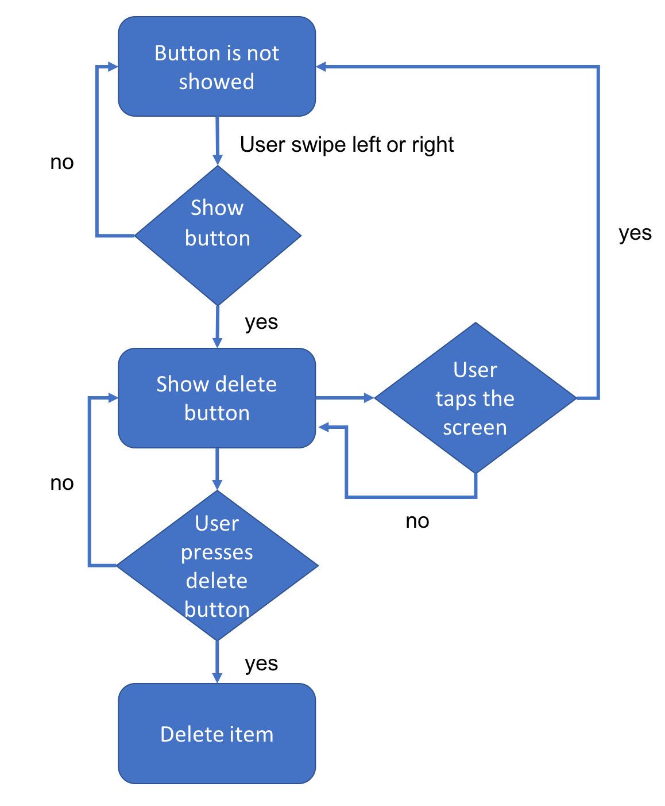

# RecyclerView with Swipe Menu

User can swipe item to left or right to show the delete button.
User can press delete button to delete the item or just tap the screen to reset.

[Reference](https://codeburst.io/android-swipe-menu-with-recyclerview-8f28a235ff28)

Some implementation details:
1. Create a SwipeController which extends ItemTouchHelper.Callback and then use the SwipeController to create a ItemTouchHelper
2. In SwipeController, we check the distance that user has swiped in onChildDraw()
```java
@Override
public void onChildDraw(
        Canvas c,
        RecyclerView recyclerView,
        RecyclerView.ViewHolder viewHolder,
        float dX,
        float dY,
        int actionState,
        boolean isCurrentlyActive) {
    if (actionState == ACTION_STATE_SWIPE) {
        if (mBtnState != BTN_STATE_GONE) {
            //>> fix x position according to button's state
            if (mBtnState == BTN_RIGHT_VISIBLE) {
                dX = Math.min(dX, -BUTTON_WIDTH);
            }
            else if (mBtnState == BTN_LEFT_VISIBLE) {
                dX = Math.max(dX, BUTTON_WIDTH);
            }
            super.onChildDraw(c, recyclerView, viewHolder, dX, dY, actionState, isCurrentlyActive);
        }
        else {
            checkSwipeState(
                    c,
                    recyclerView,
                    viewHolder,
                    dX,
                    dY,
                    actionState,
                    isCurrentlyActive);
        }
    }

    if (mBtnState == BTN_STATE_GONE) {
        super.onChildDraw(c, recyclerView, viewHolder, dX, dY, actionState, isCurrentlyActive);
    }

    mCurrentItemViewHolder = viewHolder;
}
```
3. Once the delete button is showed completed, we make all items non-clickable. This is because we want user to go back to cancel delete action by just tapping the screen.
4. Flow Chart

